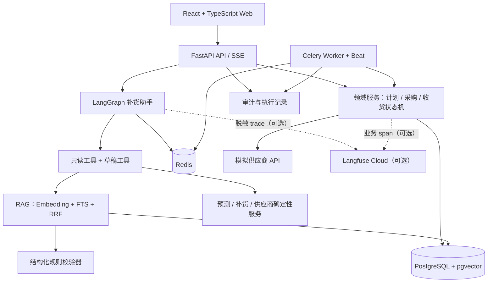
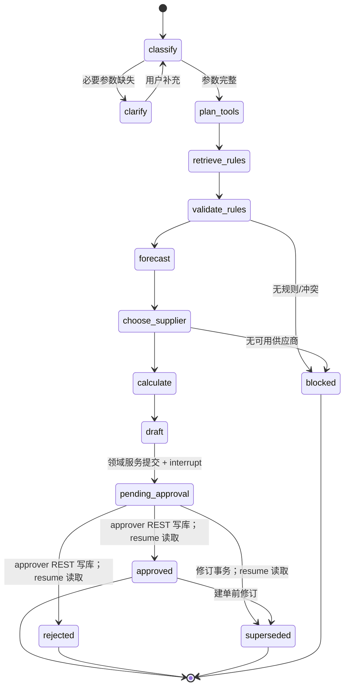
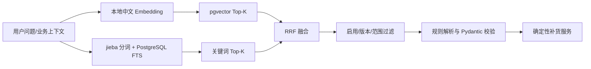

# StockMind 架构设计文档

> **版本**：V4.3
> **修订日期**：2026-09-01
> **状态**：V1 完整验收版（发布基线）已实现并本机运行验证
> **首版**：V1 本机 Docker Compose 完整闭环

## 1. 设计原则

1. **Agent 负责理解和编排，领域服务负责计算和状态。** V1 只有一个补货助手 Agent，不包装伪多 Agent。
2. **RAG 负责找证据，结构化规则负责进计算。** 自然语言文档中的数字不能被 LLM 临时转换为参数。
3. **副作用必须显式、授权、幂等。** 审批、排除/驳回、创建采购单、下单、未知状态恢复、收货、关闭/取消和管理配置不属于 LLM 工具。
4. **状态以数据库为准，checkpoint 只保存 Agent 会话恢复所需状态。**
5. **没有实测就不写完成。** 设计、代码、评测结果、生产能力分别标注。

## 2. 总体架构



### 2.1 请求责任

| 请求/动作 | 入口 | 负责组件 | LLM 是否参与 | 是否有副作用 |
|---|---|:---:|:---:|
| 手动对话、澄清、生成草稿 | SSE | LangGraph | 是 | 仅创建经校验的草稿 |
| 定时低库存扫描 | Celery | 扫描/领域服务 | 否，可复用只读工具 | 创建草稿 |
| 审批/排除/驳回 | REST | 领域服务 + 事务 | 否 | 是 |
| 创建采购单 | REST | 采购领域服务 | 否 | 是 |
| 下达采购单 | REST | 供应商适配器 + 领域服务 | 否 | 是 |
| 查询未知订单 | buyer REST / system 任务 | 供应商适配器 + 采购领域服务 | 否 | 状态恢复 |
| 分批收货/关闭/取消未下达采购单 | REST | 库存/采购领域服务 | 否 | 是 |

## 3. LangGraph 工作流



Agent State 至少包含 `thread_id`、`actor_id`、原始请求摘要、结构化参数、工具调用记录、规则来源、计划草稿、阻断原因和审批结果引用。手动路径中，受控草稿工具先调用领域服务落库，领域服务将有效草稿提交为 `pending_approval` 后 LangGraph 才执行 `interrupt`。审批人通过页面/REST 完成角色校验、事务写入和审计；`resume` 根据计划 id 与版本号重新读取审批结果，只恢复对话流程，不执行审批。

业务数据库是计划状态和审批结果的唯一事实源。checkpoint 仅用于会话中断恢复，不能作为权限凭证、审批记录或业务事务的一部分。定时扫描不创建 LangGraph checkpoint，也不进入该状态图。

审批、驳回或替代待审批手动计划的事务同时写入持久化 `workflow_resume`，提交后由 Celery 异步触发恢复，避免业务决定已提交但消息未入队。恢复键为 `thread_id + plan_id + decision_version`；重复恢复返回已有会话结果。恢复失败或 checkpoint 丢失只产生告警，不回滚业务决定，可使用同一恢复键重试。定时计划没有 `thread_id`，不写恢复请求。

### 3.1 Agent 工具白名单

只读工具：查询商品、仓库、库存、在途、历史需求、供应商关系、规则候选和预测回测。
受控工具：生成补货草稿。它只能接收强类型参数，调用领域服务并执行数量、规则、权限和幂等校验。

LLM 不可调用审批、创建采购单、下单、查询恢复、收货、关闭/取消、修改规则、定时任务配置和切换故障模式。所有工具调用都有输入长度限制、参数白名单、超时、错误码和工具审计。

## 4. 领域模型与数据责任

不在文档中承诺固定表数量，按领域定义实体：

| 领域 | 实体 | 关键责任 |
|---|---|---|
| 库存 | product、warehouse、location、lot、quant、stock_move | 现存量、预留量、库存移动事实 |
| 补货 | replenishment_plan、plan_line、replenishment_rule | 计划版本、每 SKU 计算快照和阻断原因 |
| 采购 | supplier、supplier_product、purchase_order、purchase_order_line、purchase_order_attempt | 供货能力、按供应商拆单、下单尝试、未知状态恢复与收货 |
| Agent | conversation、message、checkpoint、workflow_resume | 会话、消息、LangGraph 恢复请求及其幂等结果 |
| 知识库 | document、chunk、embedding、rule_source | 文档版本、分块、向量和规则血缘 |
| 治理 | user、audit_log、idempotency_operation、schedule、execution、execution_item、alert | 角色、审计、幂等结果、定时执行、逐 SKU 结果和页面告警 |

supplier、supplier_product、purchase_order、purchase_order_line 四个核心实体是多 SKU 按供应商拆单的最低模型；purchase_order_attempt 负责下单与未知状态恢复证据。它们不能用爬取数据或临时 JSON 替代。初始化数据全部为合成的虚构数据，并由固定随机种子生成。

## 5. RAG 与规则血缘



文档和规则分开保存：文档/分块供人阅读和引用，结构化规则供计算；每条规则必须有 `source_document_id`、`source_chunk_id`、版本和生效范围。适用优先级为 `SKU > 分类 > 仓库 > 全局`，同级按启用、当前有效、版本最高选择，仍冲突则 `blocked`。

检索文本始终按不可信数据处理。分块中的提示、角色声明、工具调用或外部链接不能改变系统指令、权限和工具白名单；Agent 只能引用文本作为证据，计算只接受结构化规则校验器输出。RAG 评测加入提示注入和伪造引用拒绝用例。

V1 预置补货策略、安全库存、仓库特殊规则、供应商约束和到货异常 SOP 五类文档。上传、编辑、启停、回滚与 Cross-Encoder 重排放 V1.1。

## 6. 确定性计算服务

### 6.1 预测服务

按仓库时区生成连续日需求序列：来源确认完整但无出库的日期补 0，来源缺失的日期不得补 0。加权移动平均使用最近 28 个完整日，权重从 1 递增到 28；简单指数平滑使用同一 28 日窗口，固定 `alpha=0.3`，以窗口最早日需求初始化。

最近 28 个完整日作为滚动单步验证期，首个验证日前至少保留 28 个连续完整训练日，因此模型比较最少需要 56 日。`MAE = mean(abs(actual-forecast))`，`WAPE = sum(abs(actual-forecast)) / sum(actual)`；验证期实际需求总和大于 0 时按 `(WAPE, MAE, algorithm_id)` 升序选择，否则 WAPE 为 `null`，按 `(MAE, algorithm_id)` 选择。算法 id 固定为 `wma_28_v1 < ses_a03_v1`。

数据不足或覆盖不可信时返回 `fixed_safety_stock_fallback`，`daily_forecast/MAE/WAPE=null`、`coverage=0`，只使用固定安全库存；固定安全库存规则也缺失时阻断。服务返回算法版本、回测窗口、完整性判断和输入快照。

### 6.2 供应商服务

在计算补货量前，先过滤禁用、超出适用期、不可供货以及价格、交期、最小采购量或整箱倍数非法的关系，再按“业务优先级升序 → 交期升序 → 采购价升序 → `supplier_id` 字典序升序”稳定排序。V1 种子价格统一为 CNY；无候选关系时阻断。服务返回选择理由和候选列表，Agent 只能解释。

### 6.3 补货服务

```text
available = on_hand - reserved
window = max(requested_window, lead_days + review_period_days)
coverage = daily_forecast * window
target = coverage + fixed_safety_stock
inbound = po_created/ordering/ordered/order_unknown/partially_received 的剩余未收量
net = max(0, target - available - inbound)
order_qty = 0                                                   if net == 0
order_qty = ceil(max(net, minimum_order_qty) / pack_multiple)
            * pack_multiple                                    if net > 0
```

`lead_days`、`minimum_order_qty` 和 `pack_multiple` 取自已选中的 SKU-供应商关系。服务要求所有数量、交期和规则值合法非负，`reserved <= on_hand`、`pack_multiple > 0`，并拒绝超过业务上限的输入，不做静默修正。服务保存每个中间量、规则来源、供应商关系、算法版本和输入快照，并对仓库业务日、库存/预留版本、采购承诺、需求截止日、规则版本、供应商关系版本和算法版本生成 `decision_input_hash`，保证同一输入可重放并可校验新鲜度。

`po_created` 已形成内部采购承诺；`ordering` 与 `order_unknown` 不能安全地视为外部未下单，因此按保守原则计入 `inbound`。采购单被授权取消、查询确认外部未创建或剩余量归零后，才从 `inbound` 中移除。

V1 的库存、采购和收货数量使用 SKU 基本单位整数；预测和指标使用十进制有效精度 28，中间过程不提前取整，计算值持久化时以 `ROUND_HALF_UP` 保留 12 位，页面与评测展示 6 位。金额统一为 CNY、单价 2 位小数；单位换算、多币种和阶梯价不在 V1。

请求载荷哈希和 `decision_input_hash` 使用带 `schema_version` 的 UTF-8 canonical JSON：键按字典序、集合按稳定业务 id、日期时间用带时区 ISO 8601、Decimal 用无指数规范字符串、`null` 显式保留，最终使用 SHA-256。哈希规范版本随计划、幂等记录和 attempt 保存，历史哈希不可重写。

## 7. 业务状态机与幂等

### 7.1 补货计划

```text
draft -> pending_approval -> approved/rejected/superseded
approved -> superseded (仅尚未创建采购单明细时)
```

计划明细标记 `valid/excluded/blocked`。`rejected/superseded` 为终态；修订必须新建计划并通过 `revision_of_plan_id` 关联原计划，且原计划尚未关联采购单明细。审批人逐条选择明细，采购单只使用有效且批准的行。

审批与创建采购单前都在事务中重算 `decision_input_hash`。任何拟批准行在审批时变化，或任何已批准行在建单时变化，整个命令返回 HTTP 409 `PLAN_STALE` 和变化字段，不部分审批、不创建任何供应商采购单，也不静默重算；审批人可以明确排除变化行后重新提交。需要重算时，操作员通过受控草稿工具创建整单修订版；新计划创建与旧计划转 `superseded`、活动明细切换在同一事务中完成。多供应商采购单创建同样全有或全无。

计划明细增加由领域服务维护的 `active_for_dedupe`。数据库使用部分唯一索引 `UNIQUE (warehouse_id, product_id) WHERE active_for_dedupe`，保证同一仓库/SKU 同时最多一个有效明细处于活动状态，与规划窗口无关。有效草稿创建时激活；排除、驳回或被修订替代时在同一事务中释放；创建采购单时，批准明细与采购单明细建立唯一关联并在同一事务中释放。批准但尚未建单的明细保持活动。修订操作必须在一个事务中先锁定旧明细，再释放旧明细并创建新明细。

`blocked` 明细不占用活动建议约束；告警使用部分唯一索引 `UNIQUE (warehouse_id, product_id, blocker_code) WHERE status = 'open'`，条件恢复后关闭。审批排除后没有剩余有效明细时只能驳回，不能产生空的已批准计划；一次扫描没有有效明细时也不创建空的待审批计划。

活动建议并发冲突映射为 HTTP 409 `ACTIVE_REPLENISHMENT_EXISTS` 并返回已有计划/明细 id。`purchase_order_line.plan_line_id` 使用唯一约束，保证一个批准明细最多进入一张采购单一次。

### 7.2 采购单

```text
po_created -> ordering | cancelled
ordering -> ordered | po_created | order_unknown
order_unknown -> ordered | po_created
ordered -> partially_received | received
partially_received -> partially_received | received
received -> closed
```

| 当前状态 | 允许目标状态 | 守卫条件 |
|---|---|---|
| `po_created` | `ordering` | `buyer` 创建新的下单尝试 |
| `po_created` | `cancelled` | 不存在进行中、未知或成功的外部下单尝试 |
| `ordering` | `ordered` | 明确成功并取得外部订单号 |
| `ordering` | `po_created` | 明确失败且确认外部未创建 |
| `ordering` | `order_unknown` | 超时、断连或响应歧义 |
| `order_unknown` | `ordered` | 查询确认外部已创建 |
| `order_unknown` | `po_created` | 查询确认外部不存在 |
| `ordered` | `partially_received/received` | 首次合法收货后按剩余量决定 |
| `partially_received` | `partially_received/received` | 后续合法收货后按剩余量决定 |
| `received` | `closed` | `buyer` 明确确认关闭 |

`closed` 和 `cancelled` 为终态。V1 没有供应商取消接口，因此 `ordered`、`order_unknown`、`partially_received` 不能直接取消。计划批准不自动创建采购单，采购员先创建，再下达。

每次 `po_created -> ordering` 都创建不可变的 `purchase_order_attempt`，记录尝试序号、内部命令幂等键、供应商幂等键、请求哈希、状态、外部订单号与时间。传输重试复用当前尝试的供应商幂等键；只有明确失败，或未知状态查询确认不存在并回到 `po_created` 后，才能创建新的下单尝试。

下单采用“先持久化、后外呼、再回写”：数据库事务先创建 attempt 并提交 `ordering`，随后在事务外调用供应商，最后按明确成功、明确失败或歧义结果写回。进程崩溃或超过配置超时仍为 `ordering` 时，恢复任务先转 `order_unknown` 再查询供应商，绝不直接重发。该协议以幂等键和对账恢复代替不存在的跨系统事务。

### 7.3 幂等不变量

- 部分唯一索引 `(warehouse_id, product_id) WHERE active_for_dedupe` 防止尚未落实的有效建议重复；
- 所有状态变更命令都携带幂等键；草稿工具使用 `operation_id`，定时行任务使用 `execution_id + warehouse_id + product_id`；
- 服务端按 `(principal_id, command_type, aggregate_ref, idempotency_key)` 定位 `idempotency_operation`；`principal_id` 是用户或内部服务主体，更新命令使用对象 id 作为 `aggregate_ref`，创建命令使用规范化业务目标键；记录保存载荷哈希、`in_progress/retryable/succeeded/failed/unknown` 状态、响应和关联对象；
- 同键同载荷在成功或终止失败后返回已有结果，前置瞬时失败可从 `retryable` 恢复；同键不同载荷返回 HTTP 409 `IDEMPOTENCY_KEY_REUSED`，执行中返回 HTTP 202 `OPERATION_IN_PROGRESS`；已经产生外部不确定结果的操作不得标记为 `retryable`；V1 不自动清理幂等记录；
- 审批、排除/驳回、建单、下单、状态查询恢复、收货、关闭/取消和管理配置都执行角色、允许转换和乐观版本校验；
- `receipt_event_id` 唯一，重复收货返回原结果；
- 收货量不能超过采购单剩余量；
- 状态迁移使用事务、版本号和允许转换表；
- 下单超时进入 `order_unknown` 后保留原供应商幂等键，只允许查询恢复，不允许换键重下。

乐观版本冲突返回 HTTP 409 `VERSION_CONFLICT`，非法迁移返回 HTTP 409 `INVALID_STATE_TRANSITION`，角色不符返回 HTTP 403 `FORBIDDEN`。浏览器为一次用户动作生成一个 UUID 幂等键，并在传输重试时复用。

非外部副作用由数据库事务原子完成。`idempotency_operation` 使用带到期时间的执行租约；租约过期后，后台可以同一操作记录恢复。供应商相关操作不得直接重放，必须根据 `purchase_order_attempt` 进入未知状态查询协议。

草稿/修订、审批、创建采购单、取消和收货按 `(warehouse_id, product_id)` 排序取得 PostgreSQL 事务级 advisory lock，并在锁内执行版本、`decision_input_hash` 和状态校验以及写入。锁超时返回 HTTP 409 `RESOURCE_BUSY`，调用方以同一幂等键重试。Redis 锁只协调 Celery 调度，不承担业务正确性；唯一约束、数据库事务锁和乐观版本才是最终防线。

收货事务锁定采购单明细，并原子写入 receipt event、库存移动、库存量、累计收货、采购单状态/版本和审计。相同 `receipt_event_id` 同载荷返回原结果，异载荷复用返回 HTTP 409 `RECEIPT_EVENT_REUSED`。

## 8. 定时任务、执行记录与告警

Celery Beat 读取带 IANA 时区的 Web 配置，Celery Worker 执行扫描；V1 种子仓库时区为 `Asia/Shanghai`。定时路径不调用对话 Agent，直接复用领域查询、规则校验和确定性计算服务。每次任务生成唯一执行记录，记录触发方式、计划时间及时区、开始/结束时间、扫描量、成功/失败数、草稿数、错误码、错误堆栈摘要和 trace id；同一 `schedule_id + scheduled_at` 只能创建一次计划执行，立即执行/手动重跑则使用管理请求的幂等键生成唯一执行。

每个仓库/SKU 使用独立事务或保存点。数据、规则或供应关系缺失及规则冲突标记为 `blocked`，未分类运行异常标记为 `failed`；二者都只影响当前行并产生或刷新去重告警，其他 SKU 继续。手动重跑复用原执行上下文或创建带来源引用的新执行记录，仍受活动建议约束和行级幂等键保护。

**实现说明**：定时扫描为每个有效仓库各生成一张待审批计划（计划按仓库维度，与 `active_for_dedupe` 部分唯一索引的 (warehouse_id, product_id) 粒度一致）；一次扫描可能产生多张计划，执行记录与逐 SKU 执行明细保持完整血缘。

每个扫描对象都写入 `execution_item`，保存 warehouse/product、`success/blocked/failed` 状态、错误码、阻断原因、计划明细引用、告警引用和 trace id。即使没有任何有效建议，也能通过 execution + execution_item 完整解释本次扫描，而无需创建空计划。

V1 告警只在页面展示；邮件/企业微信、复杂重试策略和公网部署放 V1.1。

## 9. 模拟供应商适配器

适配器提供正常成功、明确失败、超时但成功、重复幂等请求和查询订单状态接口。故障模式由 `admin` 页面/REST 切换并审计，不能由 Agent 修改。`buyer` 可手动查询其有权限的未知订单，`system` 可执行后台恢复；二者调用同一状态恢复服务。未知状态恢复必须沿用原外部幂等键，先查询再决定状态迁移，禁止无依据重试。

## 10. API 与前端

FastAPI 提供 REST 和 SSE；React + TypeScript 提供补货助手、补货工作台、审批箱、采购单、定时任务、执行记录、规则知识库、操作人切换器八个页面。所有响应包含 request/trace id 和稳定错误码；状态变更响应还包含幂等操作 id 与最新对象版本。采购单页仅在 `po_created` 显示取消命令。

V1 通过 actor_id 查种子用户角色；`system` 是 Celery 使用的内部服务主体，不能由浏览器提交 actor_id 冒充。管理员触发任务时，执行主体为 `system`，执行记录另存 `triggered_by_actor_id`。V1.1 才增加 JWT/OAuth。浏览器验收必须走通：手动补货、多轮澄清、审批逐条排除、按供应商拆单、下单未知状态恢复、分批收货和重复收货拦截。

## 11. 可观测、测试与评测

- Langfuse（可选，默认 no-op）：trace/span/generation、工具耗时、Token、成本；输入输出脱敏；未配置凭证时不初始化客户端、无网络请求，观测失败不影响业务；云端验证需真实凭证；
- 审计：操作者、动作、前后状态、对象、错误码和时间；不记密钥和完整 Prompt；
- 测试：pytest、Hypothesis、Playwright、Ruff、Mypy、GitHub Actions（无密钥环境可运行）；pgvector 扩展由迁移内 `CREATE EXTENSION IF NOT EXISTS vector` 保证（Compose/CI/裸机三场景可靠）；依赖以双锁文件精确约束（`requirements.lock` base+dev、`requirements-rag.lock` base+rag，torch 由 Dockerfile 官方 CPU 源固定 2.6.0+cpu 且零 CUDA 依赖）；CI 云端成功运行需 push 后由 Actions 执行（未提交则无云端记录）；
- 评测：参数字段准确率、RAG Recall/MRR/引用正确率、任务完成率、工具调用正确率、必要澄清率、MAE/WAPE、P50/P95、Token/成本；按 OFFLINE 与真实 LLM 双模式分表报告，报告含样本量、并发度、机器、模型与运行时间戳；成本优先读取可配置单价，缺少单价只报告 Token；
- 安全不变量：越权操作、重复有效建议、重复采购、重复入库、未知状态盲目重试、非法状态迁移、幂等键异载荷副作用必须为 0；
- 评测集固定随机种子，报告保存用例哈希和语料指纹；
- 镜像交付：仅使用 CPU Embedding，后端镜像采用官方 CPU-only PyTorch（不安装 CUDA 运行时）。

## 12. 版本路线

未明确指定版本时，实施与验收默认以 V1 为边界。V1.1/V2 可以维护为路线规划，但所有相关能力必须标注为未实现。

| 版本 | 范围 |
|---|---|
| V1 | 双触发、单 Agent、混合检索、结构化规则、确定性计算、HITL、采购闭环、故障注入、页面告警、Langfuse（可选）、测试、Docker、发布基线（CPU-only 镜像、隔离部署验证、CI 无密钥） |
| V1.1 | 公网部署、JWT/OAuth、文档运营、Cross-Encoder、邮件/企微告警、容量与灰度 |
| V2 | 动态安全库存、金额阈值审批、预算/供应商优化、多模型路由 |

## 13. 诚实边界

V1 完整验收版已实现并运行验证（代码/迁移/测试/前端齐备；Docker 镜像 CPU-only PyTorch、Langfuse 可选观测、黄金集双模式评测、隔离全新部署验证均已实测）。仍不声称：完整 WMS、多租户、高并发、生产级认证或真实企业系统接入；对话在无 LLM Key 时运行离线演示模式，配置 Key 时使用真实模型（已实测 DeepSeek）；真实 LLM 评测结果非确定性，小样本延迟不构成容量结论；Langfuse 云端 trace 未验证（未配置凭证）；成本仅在有可配置单价时估算。

## 14. 修订记录

- V4.3 功能优化（2026-09-01）：发布收口第一轮用户功能优化——前端错误可见性/恢复体验增强（助手缺参/阻断/下一步展示、审批箱 PLAN_STALE 变化字段与排除/重算入口、order_unknown 只查询提示、对话模式与 RAG 状态区分）；依赖可复现升级为双锁文件（`requirements.lock` base+dev、`requirements-rag.lock` base+rag 含 torch==2.6.0+cpu，均以官方 CPU 源解析，零 CUDA 依赖）；新增 6 项单元测试与 3 个 Playwright 场景；全套测试 122 项、7 项安全不变量全为 0；未改变任何核心架构决策。
- V4.3 审计收口（2026-09-01）：V1 发布候选审计与 CI 收口——Alembic 迁移内启用 pgvector 扩展（CI 的 PostgreSQL service 不挂载 db-init 目录，迁移自足可靠）；compose `env_file: required: false`（干净 CI 无 `.env` 可 config/build）；新增 `requirements.lock` 依赖锁文件（pip-tools，Dockerfile/CI 以 `--constraint` 应用）；CI 密钥扫描只报文件名不泄露匹配内容；CI 步骤顺序（干净库迁移→种子幂等→pytest）与 `POSTGRES_DSN` 一致性；评测 OFFLINE 模式强制禁用 LLM。CI 云端成功运行需 push 后由 GitHub Actions 执行，未提交仓库前无云端运行记录。
- V4.3 发布基线（2026-09-01）：V1 完整验收版发布基线收口——镜像交付规范（CPU-only PyTorch 2.6.0+cpu，不装 CUDA 运行时，8.81GB → 2.21GB）；观测组件规范（Langfuse 可选：无凭证安全 no-op、脱敏、关联 request/trace/thread/plan id，本地 mock 单测通过，云端未验证）；评测组件规范（OFFLINE 与真实 LLM 双模式分表，含 P50/P95/Token/成本规则）；隔离全新部署验证（独立 project/卷/端口）与 CI 无密钥可运行；全套后端测试 116 项、7 项安全不变量全为 0。
- V4.2 收口（2026-09-01）：本机收口验收——Docker Compose 容器化启动已实测（7 服务 Up，api 重启可重复启动）；Embedding 向量路径容器内实测通过；黄金集评测入口建立；修复 pgvector 检索 ORM 绑定、seed 后 alembic stamp、db 初始化扩展、Dockerfile 构建优化。
- V4.2（2026-08-31）：V1 实现完成——补充实现说明（定时扫描按仓库各建一张待审批计划），修正"代码尚未实现"状态描述。
- V4.1（2026-08-31）：明确确定性计算顺序与数值规范、数据库审批权威、持久化恢复请求、决策新鲜度、活动建议生命周期、采购承诺和下单尝试、收货原子性、统一幂等/锁及定时逐 SKU 隔离。
- V4.0（2026-08-31）：确认 V1 完整本机架构。
